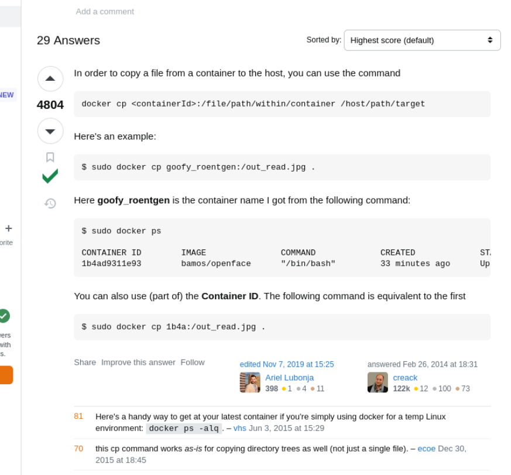
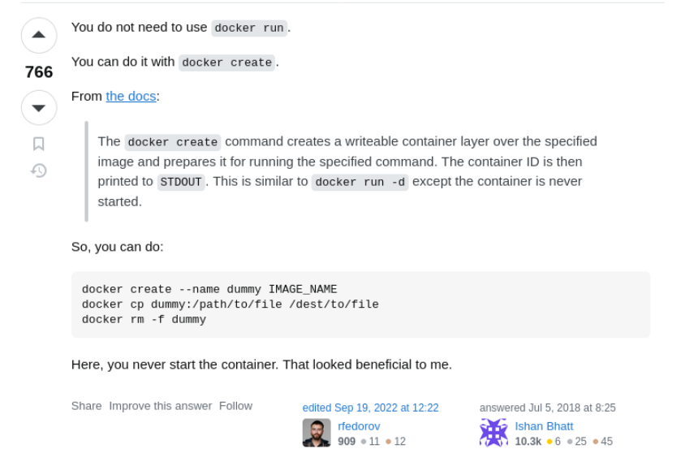
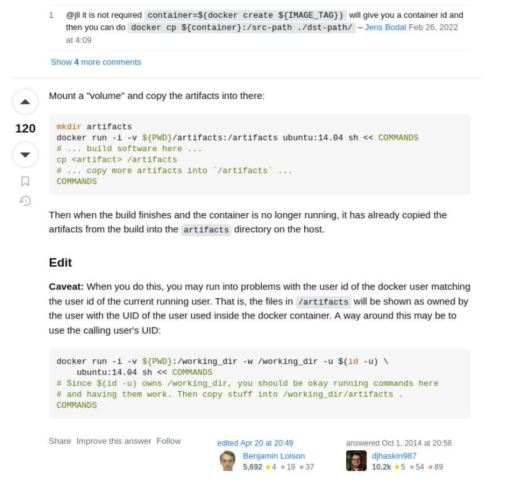

# Copy files in between Docker Container and the host

======================================
`docker create instead of docker run` |
======================================

==================================================
`handle user ownership inside container and host` |
==================================================

